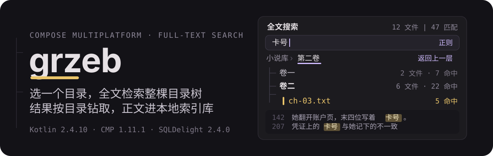
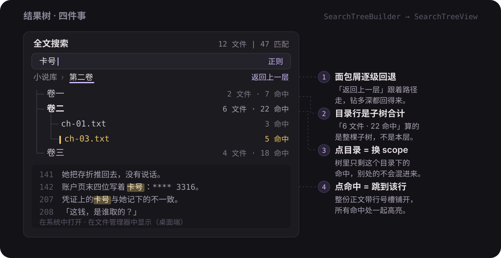
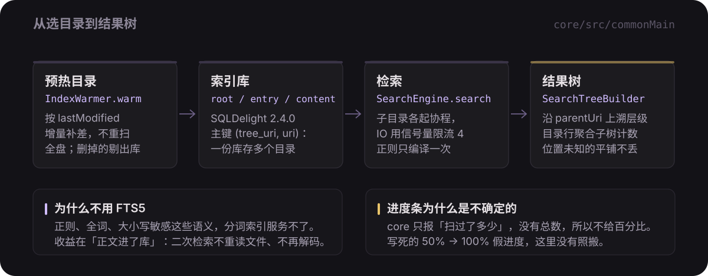
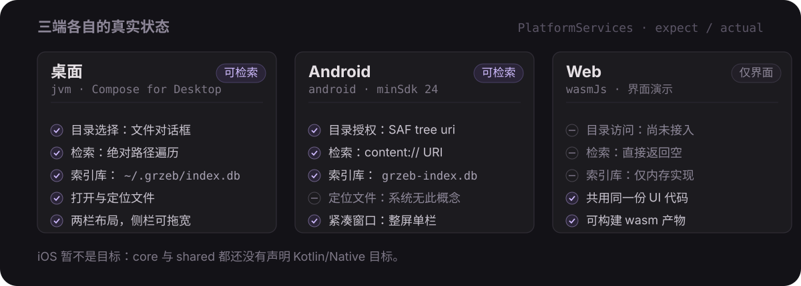

# grzeb

<p align="center">
  
</p>

<p align="center">
  <a href="https://kotlinlang.org"></a>
  <a href="https://www.jetbrains.com/compose-multiplatform/"></a>
  <a href="https://sqldelight.github.io/sqldelight/"></a>
  
</p>

<p align="center"><a href="./README.md">简体中文</a> · English</p>

Pick one directory and full-text search every plain-text file under it.
**Results are not a flat list — they are a drillable tree**: each folder row carries the file and match
counts for its whole subtree, tapping a folder switches the scope, tapping a match jumps to that line
in the body. Decoded text is cached in a local SQLDelight database, so the second search over the same
files neither re-reads from disk nor re-decodes.

> The app's UI strings are hardcoded Simplified Chinese, and the figures below keep them verbatim
> because that is what the product actually renders. Glosses are in brackets.

## The result tree

<p align="center">
  
</p>

The hierarchy is not guessed from result paths — it is walked up through the `parentUri` chain stored in
the index (`core/…/search/SearchTree.kt:56-111`). That is what lets Android SAF `content://` URIs and
desktop absolute paths share one implementation. While the index is still warming, files whose position
cannot be resolved hang flat under the current scope: **ugly placement beats dropping a result**.

## How it runs

<p align="center">
  
</p>

- **No FTS5, deliberately.** Search has to support regex, whole-word and case sensitivity — semantics a
  tokenized index cannot serve. The real payoff is that bodies live in the `content` table: a second
  search pulls text out of the database and matches in memory, with exactly production semantics
  (`core/…/db/Index.sq:1-11`).
- **Parallel walk.** Each subdirectory gets its own coroutine, files in one directory are split into
  batches, and a `Semaphore(concurrency)` caps in-flight IO (default 4). On Android every SAF call is a
  cross-process query, so the bottleneck is latency, not bandwidth — concurrency is pure gain
  (`core/…/search/SearchEngine.kt:62,167,196-235`). The cost: **result order is not deterministic**; whoever
  finishes scanning first lands first.
- **Read-through cache.** `IndexedFileSystem` checks the snapshot first and falls back to the real
  filesystem while warming is incomplete; once warming lands it re-checks the timestamp every second and
  switches over (`core/…/index/IndexedFileSystem.kt:21-77,100`).
- **Incremental warming** diffs by `lastModified` and evicts entries that vanished from disk
  (`core/…/index/IndexWarmer.kt:87-88,189`). It starts on its own when you pick a directory.
- **The last directory is remembered**: on launch the most recent `root` row refills it, so you do not
  re-pick every time (`Index.sq:45-47`, `shared/…/SearchScreen.kt:86-90`).

### Chinese text must not turn into mojibake

The decision order lives in `core/…/text/TextDecoder.kt:6-20`:

```text
1. BOM: UTF-8 / UTF-16 LE / UTF-16 BE
2. Contains NUL → "one NUL every other byte" reads as BOM-less UTF-16; otherwise it is binary
   (jpg / apk / zip are rejected right here)
3. Decode as UTF-8; accept if no replacement characters appeared
4. Fall back to GB18030 (a superset of GBK / GB2312) — most Chinese novels are this. Two gates:
   no replacement characters, and CJK share ≥ 5%
5. Only when replacement characters exceed 1/10 of the text does it drop to byte-by-byte Latin-1;
   otherwise the UTF-8 string comes back *with* its replacement characters (so outside that gate,
   bad bytes really are lost)
```

Gate one on step 4 stops Latin-1 bodies from being mistaken for GBK (an accented byte in French is
usually followed by a space or punctuation, which is not a legal GBK trail byte). Gate two stops files
that are "mostly ASCII with a few high bytes".

## Quick start

Requirements: JDK 17+ (Gradle 9.6.1 comes from the wrapper — the JDK is yours to install); the Android
target needs an SDK with compileSdk 37. `settings.gradle.kts` puts Aliyun mirrors first, because direct
connections to Maven Central occasionally stall in `CLOSE_WAIT` from CN networks.

```bash
./gradlew :desktopApp:run                              # desktop, opens a window
./gradlew :androidApp:installDebug                      # Android: install the debug build on a device
./gradlew :webApp:wasmJsBrowserDevelopmentRun           # Web (wasmJs): UI only, see below
```

First search is four steps:

1. Tap 「点击选择搜索目录...」(*"click to pick a search directory"*) — a file dialog on desktop (native
   `FileDialog` on macOS, Swing `JFileChooser` elsewhere, both titled 「选择搜索目录」), a SAF tree grant
   on Android;
2. wait for the 「正在建索引…」(*"building index…"*) warm bar — or don't, the search falls back to the
   live filesystem by itself;
3. type a keyword and press 「搜索」(*"search"*);
4. in the tree: tap a folder to drill in, tap the breadcrumb to step back, tap a match to jump to its line.

Packaging: `:desktopApp:packageDistributionForCurrentOS` (or `:packageUberJarForCurrentOS`) and
`:webApp:wasmJsBrowserDistribution`.

## What each platform really does

<p align="center">
  
</p>

| | Desktop (jvm) | Android | Web (wasmJs) |
| --- | --- | --- | --- |
| Directory access | file dialog (native on macOS, Swing elsewhere) | SAF tree uri | **not wired up** |
| Index store | `~/.grzeb/index.db` | `grzeb-index.db` | in-memory only |
| Real search | yes | yes | no — returns empty |
| Reveal in file manager | yes (`open -R` / `explorer /select,` / `xdg-open`) | no such concept | no |

All three share one UI; every platform difference is funneled through the single `PlatformServices`
interface (`shared/…/platform/PlatformServices.kt:14-43`, `expect fun rememberPlatformServices()` plus
three actuals). The web build **compiles, runs and is feature-complete as a shell**, but has no directory
access, so `isSupported=false` short-circuits search to an empty result
(`shared/…/PlatformServices.wasmJs.kt:19-33`, `core/…/search/SearchEngine.kt:160`). For now it is a UI demo.

Layout follows M3 window size classes at 600 / 840dp, measured on **content width**. Two panes appear only
in an expanded window (at medium width the list has no room left after a 400dp sidebar); the sidebar is
drag-resizable and double-click resets it (`shared/…/ui/AdaptiveLayout.kt:24-60,77-99`), and its width is
kept in `rememberSaveable` (`shared/…/SearchScreen.kt:107`). The desktop window opens at 1120×780 so it
lands in the expanded class and shows two panes immediately.

## Search options in the UI

The 「搜索选项」(*"search options"*) disclosure holds exactly four checkboxes
(`shared/…/SearchScreen.kt:381-392`):

| Label | Meaning |
| --- | --- |
| 区分大小写 (*case sensitive*) | off by default |
| 正则表达式 (*regex*) | the whole query compiles as-is and is **not** tokenized; failure shows 「正则表达式无效」 |
| 全词匹配 (*whole word*) | only applies to terms **without CJK characters** — CJK never forms a `\b`, so adding one yields an always-false pattern |
| 每文件首个 (*first per file*) | keep only the first match in each file |

`SearchOptions.isWildcard` (`*` across newlines, `?` one non-newline char) and `isMultiKeyword`
(whitespace-tokenized unordered AND with `"phrases"` and `-exclusions`) **are implemented in core and
covered by tests, but the UI has no toggle for them** — `search()` passes only those four switches plus
two hardcoded constants, so today you cannot reach them. Same for `maxDepth`, `ignoredDirs`,
`includeExtensions` and the concurrency cap: **values live in code only, no settings screen**. The UI
pins `maxDepth` at **15** (`shared/…/SearchUiState.kt:320`); core's default of 10 is never what ships.

## Layout of the code

```text
core/       filesystem abstraction · decoding · index store & warming · search engine ·
            result-tree builder   (zero UI dependencies)
shared/     the one Compose UI + PlatformServices (expect / actual)
desktopApp/ window entry       androidApp/ Activity entry       webApp/ ComposeViewport entry
```

One dependency edge: `shared → core`. All three app modules depend only on `shared`.
Wiring is manual — `rememberPlatformServices()` plus `remember {}`; no Koin, no Hilt.

| To change | Go to |
| --- | --- |
| Add an extension | `core/…/text/TextFileTypes.kt:9-23` (52 plain-text + 4 ebook names on the list) |
| Change query syntax | `core/…/search/QueryParser.kt` |
| Change index schema | `core/…/sqldelight/…/Index.sq` |
| Add a platform | implement the `PlatformServices` actual and a `GrzebFileSystem` |

## Development

```bash
./gradlew :core:jvmTest        # 7 JVM test classes: parsing / engine / tree / decoding / index trio
./scripts/dev-desktop.sh       # restart the desktop app on any .kt / .kts / .sq change, ~10-30s a cycle
```

`dev-desktop.sh` polls once a second instead of using `fswatch`: fswatch block-buffers (4KB) when writing
events into a pipe, so a single change never reaches `while read`. It only kills matched processes whose
executable is `java` — matching on the command line alone also hits any shell that happens to mention
those strings.

## Current limits

The parts I am not going to gloss over:

- **The web build cannot search.** No directory access; only the UI is real.
- **iOS is not a target right now**: neither `core` nor `shared` declares a Kotlin/Native target, and
  there is no `iosMain`.
- **No ebook bodies.** `.epub` / `.mobi` / `.fb2` / `.rtf` are on the extension whitelist, but no parser is
  wired up: epub is a zip and mobi is binary, so their NUL bytes get them rejected as binary at step 2 of
  decoding; fb2 (XML) and rtf *are* text and get searched **raw** — you match tags and escape sequences,
  not prose. Do not read this as EPUB support.
- **No statistical encoding detection yet**: BOM-less UTF-16 whose body is Chinese is unrecognizable and
  gets skipped as binary.
- **No settings screen, no manual "rebuild index" entry** (`IndexedFileSystem.invalidate` has no
  callers; `IndexStore.clear` is only ever called from a test), **and no search-history UI**
  (`scopeHistory` is maintained in state but never rendered).
- **The progress bar is indeterminate**: core reports "how many scanned", never a total, so there is no
  percentage. The hardcoded 50% → 100% from the React version was not carried over.
- Per-file read cap **8 MB**, at most **500** matches recorded per file, the UI walks **15** levels deep
  (core's default is 10), and dot-prefixed directories plus `node_modules` and friends are skipped.
- **UI copy is hardcoded Simplified Chinese** — no string resources, no localization.
- This branch has no `LICENSE` file yet.

## Provenance

The `compose` branch is the Compose Multiplatform rewrite. The React Native implementation of the same
product lives on the `react` branch (its README is at `origin/react:README.md`), and the older starting
point was a Tauri + React Android template (at `origin/main:README.md`; there is no local `main`).
This version pulls search and indexing into a platform-agnostic `core` and keeps exactly one UI.
